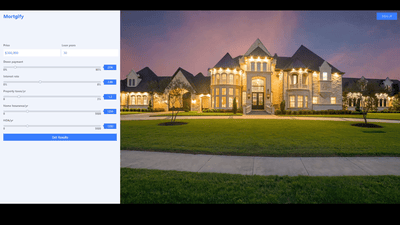
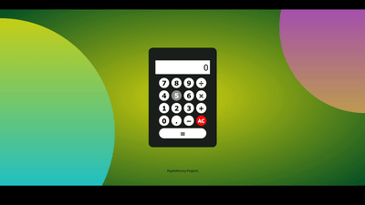

<!-- MY BANNER SECTION -->

<!-- MY INTRO SECTION -->
<h1 align="center"> Hello World  I'm </h1>

    <a href="https://github.com/rayanthoney" target="_blank" >
    &nbsp;&nbsp;
    
    </a>

<!-- MY ABOUT ME SECTION -->

<h2 align="center">🎇 About Me 🌟 </h2>

<em>I am a Software Engineer and Freelancer focused on full stack web development. I build beautiful and meaningful web experiences via clean and accessible code. Spending a good amount of time learning and testing new technologies to aid myself in this process is something I enjoy. I pride myself on being able to manage my frustrations to achieve ✨Magical✨ outcomes.<em>

 

<!-- MY SOCIAL MEDIA SECTION -->
<h3 align="left">📫 Reach out to me! 👇</h3>
 

    &nbsp;
	&nbsp;
    &nbsp;
    &nbsp;
    &nbsp;

 
 
 

<h3 align="left">Check out my Code Wars! 👇</h3>

 
 

    <a href="https://github.com/rayanthoney/100Devs-Bootcamp/tree/master/code-wars" target="_blank" >
    &nbsp;&nbsp;

 
 

<!-- MY PERSONAL PROJECTS SECTION -->
<h2 align="center">Projects</h2>

	<table>
		<tr>
			<td width="50%">
				<h3 align="center">
				Mortgage Calculator
				</h3>
				

					
					 
					 
					

						
						
					

					
<strong>HTML5, CSS3, JavaScript</strong> - JavaScript version "Mortgage Calculator" with working sliders allowing the user to adjust the specifics based on loan varibles. The get results will show a graph with all loan info in a handy pop up.

				

			</td>
			<td width="50%">
				<h3 align="center">
				Jeep Static Landing Page
				</h3>
				

					
					 
					 
					

						
						
					

					 
<strong>HTML5, CSS3, JavaScript</strong> - JavaScript Slider static website that dynamically or manually displays Automobile Flagships from Jeep. This site was created based on "Codingphase Practical Javascript Course Scenario2" 

				

			</td>
		</tr>
		<!-- Third Row  -->
		<tr>
			<td width="50%">
				<h3 align="center">
				100Devs Calculator
				</h3>
				

					
					 
					 
					

						
						
					

					
<strong>HTML5, CSS3, JavaScript</strong> - 100Devs working calculator using event listners and constructors. This project was created in a group session with Mayanwolfe and 100Devs team.
					 
					 
					

				

			</td>
			<td width="50%">
				<h3 align="center">
				Personal Branding Portfolio
				</h3>
				

					
					 
					 
					

						
						
					

					
<strong>HTML5, CSS3, JavaScript</strong> - Portfolio Baranding website created based on Codingphase "Web Developer Personal Brand and Portfolio"
					course. This site was created using the above technologies and can be edited for personal use.

				

			</td>
		</tr>
		<tr>
			<td width="50%">
				<h3 align="center">
				Upcoming Place Holder
				</h3>
				

					
					 
					 
					

						
						
					

					
<strong>Lorem ipsum dolor sit amet, consectetur adipiscing elit, sed do eiusmod tempor incididunt ut labore et dolore magna aliqua.</strong>

					<ul align=left>
					<li>Mauris rhoncus aenean vel elit scelerisque. Neque viverra justo nec.
					</li>
					<li>Mauris rhoncus aenean vel elit scelerisque. Neque viverra justo nec.
					</li>
					<li>Mauris rhoncus aenean vel elit scelerisque. Neque viverra justo nec.
					</li>
					<li>Mauris rhoncus aenean vel elit scelerisque. Neque viverra justo nec.
					</li>
					

					 
					 
					

				

			</td>
			<td width="50%">
				<h3 align="center">
				3D ThreeJS AI Showcase
				</h3>
				

					
					 
					 
					

						
						
					

					
<strong>Lorem ipsum dolor sit amet, consectetur adipiscing elit, sed do eiusmod tempor incididunt ut labore et dolore magna aliqua.</strong>

					<ul align=left>
					<li>Mauris rhoncus aenean vel elit scelerisque. Neque viverra justo nec.
					</li>
					<li>Mauris rhoncus aenean vel elit scelerisque. Neque viverra justo nec.
					</li>
					<li>Mauris rhoncus aenean vel elit scelerisque. Neque viverra justo nec.
					</li>
					<li>Mauris rhoncus aenean vel elit scelerisque. Neque viverra justo nec.
					</li>
					

				

			</td>
		</tr>
	</table>

 
 

<!-- MY TECHNOLOGY TOOLS SECTION -->
<h2 align="center">🛠 Technical Languages and Tools </h2>
 
 

	

		<code></code>&nbsp;<code></code>&nbsp;<code></code>&nbsp;<code></code>&nbsp;<code></code>&nbsp;<code></code>
	

 
 
	

		<code></code>&nbsp;<code></code>&nbsp;<code></code>&nbsp;<code></code>&nbsp;<code></code>
	

 
 
	

		<code></code>&nbsp;<code></code>&nbsp;<code></code>&nbsp;<code></code>&nbsp;<code></code>
	

 

<!-- MY VISITOR COUNTER SECTION -->
<h4 align="left">Profile Visits Counter<h4>

