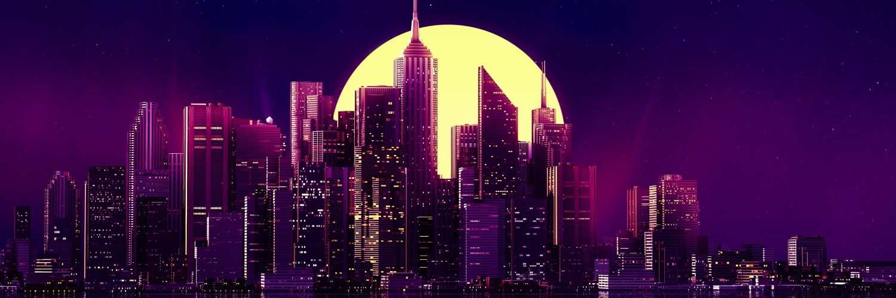

## Hello World, I'm Ray Anthoney 
I am a **Designer**, **Web Developer**, **Freelancer**, **Dog Lover**,  I Spend most of time coding outstanding projects.

:mailbox: Reach out to me!

 
  
 

 ### Languages and Tools:
 

&nbsp;&nbsp;&nbsp;&nbsp;&nbsp;&nbsp;&nbsp;&nbsp;&nbsp; 

#### Profile Visits :octocat:

<!--
**rayanthoney/rayanthoney** is a ✨ _special_ ✨ repository because its `README.md` (this file) appears on your GitHub profile.

Here are some ideas to get you started:

- 🔭 I’m currently working on ...
- 🌱 I’m currently learning ...
- 👯 I’m looking to collaborate on ...
- 🤔 I’m looking for help with ...
- 💬 Ask me about ...
- 📫 How to reach me: ...
- 😄 Pronouns: ...
- ⚡ Fun fact: ...
-->
