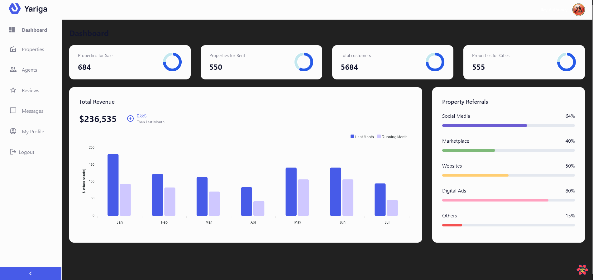
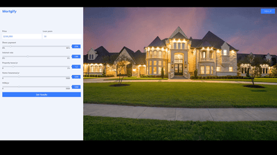
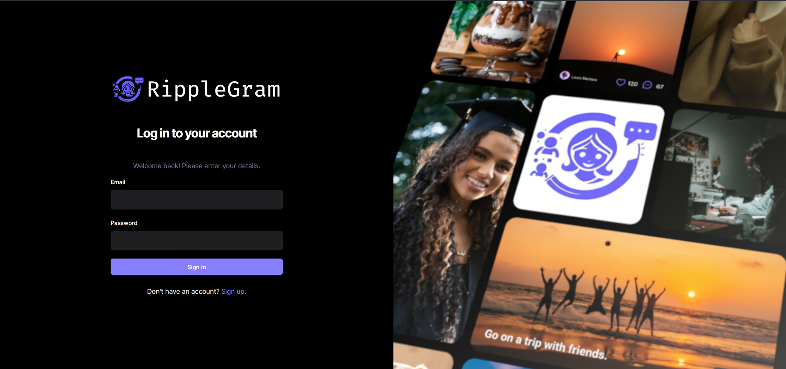
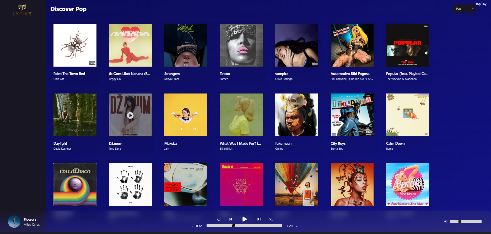

<!-- Improved compatibility of back to top link: See: https://github.com/rayanthoney/rayanthoney -->

<!-- MY BANNER SECTION -->

[![Product Name Screen Shot][product-screenshot]](https://example.com)

 

  <h1 align="center"> Hello World  I'm RayAnthoney</h1>

  <!-- MY ABOUT ME SECTION -->

## 🎇 About Me 🌟

I am a Software Engineer and Freelancer focused on full-stack web development. Welcome to my digital haven! I'm thrilled to share my journey and passion for software engineering with you. Stay tuned as I craft a space that showcases my projects, skills, and the endless possibilities that code unlocks. The future of technology is always coming around the corner, and ✨ I'm <em>excited<em> ✨ to bring you along for the 🎢 ride!

<!-- TABLE OF CONTENTS -->

  
Table of Contents

  <ol>
    <li><a href="#reach-out-to-me">📫 Reach out to me! 👇</a></li>
    <li>
      <a href="#my-tech-stack">🛠️ My Tech Stack</a>
      <ul>
        <li><a href="#frontend">🎨 Frontend</a></li>
        <li><a href="#backend">🔧 Backend</a></li>
        <li><a href="#devops">🚀 DevOps</a></li>
        <li><a href="#code-wars">🤺 Code Wars</a></li>
      </ul>
    </li>
    <li><a href="#projects">Projects</a></li>
  </ol>

## 📫 Reach out to me! 👇

[![Blue-Sky][Blue-Sky]][Blue-Sky-url]
[![Twitter][Twitter]][Twitter-url]
[![Instagram][Instagram]][Instagram-url]
[![GMail][GMail]][GMail-url]
[![Website][Website]][Website-url]

<!-- MY TECH STACK -->

## 🛠️ My Tech Stack

### 🎨 Frontend

[![HTML5][HTML5]][HTML5-url]
[![CSS3][CSS3]][CSS3-url]
[![Javascript][Javascript]][Javascript-url]
[![Tailwind CSS][Tailwind]][Tailwind-url]
[![React][React.JS]][React-url]
[![TypeScript][TypeScript]][TypeScript-url]
[![Next][Next.js]][Next-url]
[![Vite][Vite]][Vite-url]
[![Bootstrap][Bootstrap]][Bootstrap-url]
[![Three JS][Three.js]][Three.JS-url]

### 🔧 Backend

[![Node JS][Node.js]][Node.JS-url]
[![Express JS][Express.JS]][Express.JS-url]
[![MongoDB][MongoDB]][MongoDB-url]
[![Appwrite][Appwrite]][Appwrite-url]
[![MySql][MySql]][MySql-url]
[![PHP My Admin][PHPMyAdmin]][PHPMyAdmin-url]
[![Laravel][Laravel]][Laravel-url]
[![Wordpress][Wordpress]][Wordpress-url]

### 🚀 DevOps

[![Docker][Docker]][Docker-url]
[![NGINX][NGINX]][NGINX-url]
[![NPM][NPM]][NPM-url]

### 🤺 Code Wars

[![Code Wars][Code-Wars]][Code-Wars-url]

(<a href="#readme-top">back to top</a>)

<!-- MY PROJECTS -->

## 💻 Projects

	<table>
		<tr>
			<td width="50%">
				<h3 align="center">Project 1</h3>
				
  
					
 
 
					

						  
						

                    <strong>Features:</strong> Dynamic user authentication, responsive UI with Tailwind, real-time data sync using Firebase.
                    

    			

    		</td>
    		<td width="50%">
    			<h3 align="center">Project 2</h3>
    			

    				
 
 
    				

    					
    					
    				

    				 
<strong>HTML, CSS, Javascript</strong>

    				
Description goes here

    			

        </tr>
        <tr>
            <td width="50%">
                <h3 align="center">Project 3</h3>
                

                    
 
 
                    

                        
    					
                    

                    
<strong>HTML, CSS, Javascript, React, Tailwind, Tanstack, Shadcn, Appwrite</strong>

    	    
Full Stack Social Media App | React JS, Appwrite, Tailwind CSS, React Query.

                

            </td>
            <td width="50%">
                <h3 align="center">Project 4</h3>
                

                    
 
 
                    

                        
    					
                    

                    
<strong>HTML, CSS, Javascript, React, Tailwind, Redux, Rapid API</strong>

    	    
Spotify 2.0 Clone Music App with React & Tailwind

                

            </td>
        </tr>
    </table>

(<a href="#readme-top">back to top</a>)

<!-- MARKDOWN LINKS & IMAGES -->
<!-- https://www.markdownguide.org/basic-syntax/#reference-style-links -->

<!-- FRONT END -->

[Blue-Sky]: https://img.shields.io/badge/Blue_Sky-0085ff?style=for-the-badge&logo=bluesky&logoColor=white
[Blue-Sky-url]: https://bsky.app/profile/rayanthoney.bsky.social
[Twitter]: https://img.shields.io/badge/Twitter-08afee?style=for-the-badge&logo=x&logoColor=white
[Twitter-url]: https://x.com/rayanthoney
[Instagram]: https://img.shields.io/badge/Instagram-d43aae?style=for-the-badge&logo=instagram&logoColor=white
[Instagram-url]: https://www.instagram.com/rayanthoney/
[GMail]: https://img.shields.io/badge/Email-cb3837?style=for-the-badge&logo=gmail&logoColor=white
[GMail-url]: mailto:contact@rayanthoney.com
[Website]: https://img.shields.io/badge/Website-7952B3?style=for-the-badge&logo=firefox&logoColor=white"
[Website-url]: https://rayanthoney.com

<!-- CODE WARS -->

[Code-Wars]: https://img.shields.io/badge/Code_Wars-f05656?style=for-the-badge&logo=codewars&logoColor=white
[Code-Wars-url]: https://github.com/rayanthoney/100Devs-Bootcamp/tree/master/code-wars

<!-- BANNER IMAGE -->

[product-screenshot]: images/projects/screenshot.webp

<!-- FRONTEND -->

[HTML5]: https://img.shields.io/badge/HTML5-E34F26?style=for-the-badge&logo=html5&logoColor=white
[HTML5-url]: https://example.com
[CSS3]: https://img.shields.io/badge/CSS3-1572B6?style=for-the-badge&logo=css3&logoColor=white
[CSS3-url]: https://example.com
[Javascript]: https://img.shields.io/badge/JavaScript-F7DF1E?style=for-the-badge&logo=javascript&logoColor=black
[Javascript-url]: https://example.com
[Tailwind]: https://img.shields.io/badge/Tailwind_CSS-06B6D4?style=for-the-badge&logo=tailwindcss&logoColor=white
[Tailwind-url]: https://example.com
[React.js]: https://img.shields.io/badge/React-20232A?style=for-the-badge&logo=react&logoColor=61DAFB
[React-url]: https://example.com
[TypeScript]: https://img.shields.io/badge/TypeScript-007ACC?style=for-the-badge&logo=typescript&logoColor=white
[TypeScript-url]: https://example.com
[Next.js]: https://img.shields.io/badge/next.js-000000?style=for-the-badge&logo=nextdotjs&logoColor=white
[Next-url]: https://nextjs.org/
[Vite]: https://img.shields.io/badge/Vite-007ACC?style=for-the-badge&logo=vite&logoColor=white
[Vite-url]: https://example.com
[Bootstrap]: https://img.shields.io/badge/Bootstrap-7952B3?style=for-the-badge&logo=bootstrap&logoColor=white
[Bootstrap-url]: https://getbootstrap.com
[Three.JS]: https://img.shields.io/badge/Three.js-000000?style=for-the-badge&logo=three.js&logoColor=white
[Three.JS-url]: https://example.com

<!-- BACKEND -->

[Node.JS]: https://img.shields.io/badge/Node.js-339933?style=for-the-badge&logo=nodedotjs&logoColor=white
[Node.JS-url]: https://example.com
[Express.JS]: https://img.shields.io/badge/Express.js-000000?style=for-the-badge&logo=express&logoColor=white
[Express.JS-url]: https://example.com
[MongoDB]: https://img.shields.io/badge/MongoDB-47A248?style=for-the-badge&logo=mongodb&logoColor=white
[MongoDB-url]: https://example.com
[Appwrite]: https://img.shields.io/badge/Appwrite-F02E65?style=for-the-badge&logo=appwrite&logoColor=white
[Appwrite-url]: https://example.com
[MySql]: https://img.shields.io/badge/MySQL-4479A1?style=for-the-badge&logo=mysql&logoColor=white
[MySql-url]: https://example.com
[PHPMyAdmin]: https://img.shields.io/badge/Php_My_Admin-6C78AF?style=for-the-badge&logo=phpmyadmin&logoColor=white
[PHPMyAdmin-url]: https://example.com
[Laravel]: https://img.shields.io/badge/Laravel-FF2D20?style=for-the-badge&logo=laravel&logoColor=white
[Laravel-url]: https://laravel.com
[Wordpress]: https://img.shields.io/badge/WordPress-%23117AC9.svg?style=for-the-badge&logo=WordPress&logoColor=white
[Wordpress-url]: https://example.com

<!-- DEV OPS -->

[Docker]: https://img.shields.io/badge/Docker-2496ED?style=for-the-badge&logo=docker&logoColor=white
[Docker-url]: https://example.com
[NGINX]: https://img.shields.io/badge/Nginx-269539?style=for-the-badge&logo=nginx&logoColor=white
[NGINX-url]: https://example.com
[NPM]: https://img.shields.io/badge/NPM-CB3837?style=for-the-badge&logo=npm&logoColor=white
[NPM-url]: https://example.com
